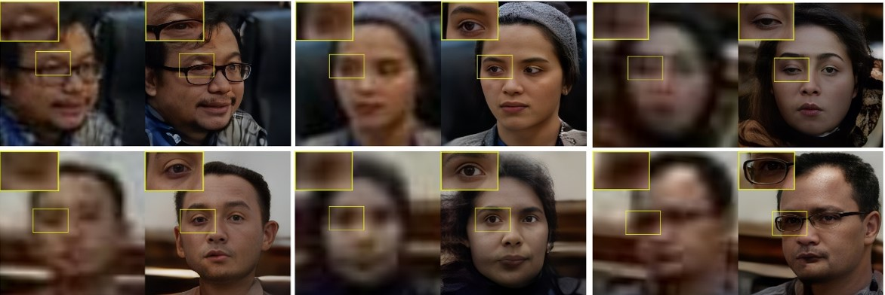
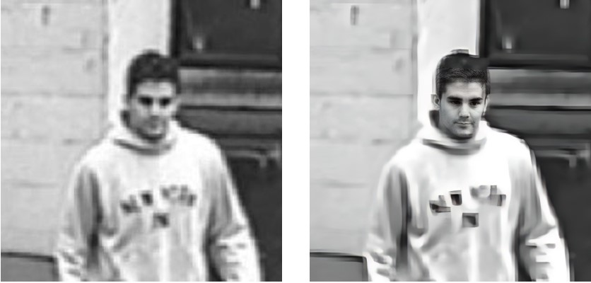

 

    

# RealESRGAN Fine-tuning

This repository contains an implementation for fine-tuning RealESRGAN on your custom dataset. RealESRGAN is a state-of-the-art image super-resolution model based on the ESRGAN architecture. By fine-tuning the pre-trained RealESRGAN model on your specific dataset, you can achieve even better results for your specific use case.

## Requirements

- Python 3.7 or higher
- PyTorch 1.9 or higher
- torchvision
- Pillow
- [BasicSR](https://github.com/xinntao/BasicSR) package
- [Pre-trained RealESRGAN](https://github.com/xinntao/Real-ESRGAN) model weights

## Usage

1. Clone this repository:
  git clone https://github.com/mohripan/RealESRGAN-FineTuning.git
  cd RealESRGAN-FineTuning

2. Install the required packages:
  pip install torch torchvision Pillow

3. Clone the BasicSR repository and install the package:
  git clone https://github.com/xinntao/BasicSR.git
  cd BasicSR
  python setup.py develop
  cd ..
  

4. Download the pre-trained RealESRGAN model weights and place them in the `weights` folder.

5. Prepare your custom dataset by organizing high-resolution images in the `Dataset/HighResolution` folder and corresponding low-resolution images in the `Dataset/LowResolution` folder.

6. Run the fine-tuning script:
  python fine-tuning.py

7. After training, the fine-tuned model weights will be saved in the `fine-tune-weights` folder.

## Customization

You can customize the training process by modifying the `fine-tuning.py` script:

- Change the number of epochs for training by updating the `num_epochs` variable.
- Change the learning rate for the optimizer by updating the `lr` parameter in `torch.optim.Adam`.
- Change the batch size by updating the `batch_size` parameter in the `DataLoader` initialization.

## Result

    

 

    

## Acknowledgements

This implementation is based on the [Real-ESRGAN](https://github.com/xinntao/Real-ESRGAN) repository by Xintao Wang and the ESRGAN model.

## License

This project is released under the [MIT License](LICENSE).
